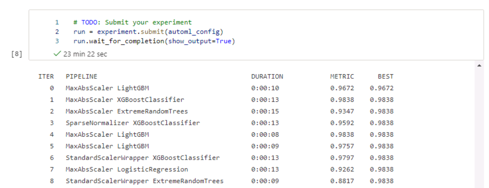

*NOTE:* This file is a template that you can use to create the README for your project. The *TODO* comments below will highlight the information you should be sure to include.

# Forest Fire Prediction

*TODO:* Write a short introduction to your project.\
The models are trained to predict if there will be a forest fire in Algeria. The models will be trained using automl and hyperparameter tuning. The best model will then be deployed. 

## Project Set Up and Installation
*OPTIONAL:* If your project has any special installation steps, this is where you should put it. To turn this project into a professional portfolio project, you are encouraged to explain how to set up this project in AzureML.

## Dataset

### Overview
*TODO*: Explain about the data you are using and where you got it from.\
The Algerian Forest Fires Dataset is obtained from UCI Machine learning Repository. Link: https://archive.ics.uci.edu/ml/datasets/Algerian+Forest+Fires+Dataset++

It contains 244 instances for 2 regions of Algeria in the period of Jun 2012 to Sep 2012. 
### Task
*TODO*: Explain the task you are going to be solving with this dataset and the features you will be using for it.\
Using 11 variables namely date, temperature, relative humidity (RH), wind speed (Ws), Rain, Fine Fuel Moisture Code (FFMC), Duff Moisture Code (DMC), Drought Code (DC), Initial Spread Index (ISI), Buildup Index (BUI) and Fire Weather Index (FWI), a classification model will be built to predict if there will be a forest fire. 

### Access
*TODO*: Explain how you are accessing the data in your workspace.
The dataset is registered in the workspace as 'forestfire' and the dataset can be obtained via the registered name as seen from the screenshot.\ 
 
## Automated ML
*TODO*: Give an overview of the `automl` settings and configuration you used for this experiment
The following shows the automl settings. \
In summary, the experiment timeout was set to 30mins and the primary metric is accuracy.
 
### Results
*TODO*: What are the results you got with your automated ML model? What were the parameters of the model? How could you have improved it? \ 
The best model is a voting ensemble model with an accuracy of 0.98783. The other models tested can be found in the screenshot below. One way to improve the model is to include a 5-fold cross validation setting in the automl settings. \
 

*TODO* Remeber to provide screenshots of the `RunDetails` widget as well as a screenshot of the best model trained with it's parameters.
There is a bug in the RunDetails widget where the widget was not shown despite no error. I have rerun the script several times however it did not appear. (The RunDetails widget worked for the hyperparameters tuned model).\
 

However, the details of the experiments can also be found in the Jobs section as seen in the screenshot below.\
 

The parameters of the best model can be seen in the screenshot below.\
 
## Hyperparameter Tuning
*TODO*: What kind of model did you choose for this experiment and why? Give an overview of the types of parameters and their ranges used for the hyperparameter search
Since this is a classification project, Logistic Regression was used. The parameters used are C and max_iter. The ranges are the hyperparameter search are C values of 0.1, 1, 5, 10 while max_iter values of 500, 1000, 4000, 10000.
See screenshot below for the hyperparameters configuration. 
 

### Results
*TODO*: What are the results you got with your model? What were the parameters of the model? How could you have improved it?
The best model has an accuracy of 0.94521 with C being 1 and max_iter is 10000. To improve the model, a wider range of C and max_iter could be used. 

*TODO* Remeber to provide screenshots of the `RunDetails` widget as well as a screenshot of the best model trained with it's parameters.
RunDetails Widget:\
 
 

The best model has the C = 1 and max_iter = 10000
 

## Model Deployment
*TODO*: Give an overview of the deployed model and instructions on how to query the endpoint with a sample input.
The best model (generated from automl) is deployed using ACI webservice. See below for the ACI configuration settings and the status of endpoint deployed.\
 
 

To query the endpoint, we can send a sample data and post the request to the endpoint as shown in the screenshot below. The response was 0, indicating that with the values posted, there should be no forest fire predicted.\
 

## Screen Recording
*TODO* Provide a link to a screen recording of the project in action. Remember that the screencast should demonstrate:
- A working model
- Demo of the deployed  model
- Demo of a sample request sent to the endpoint and its response
Link to screen recording: https://youtu.be/PxClzdowAXQ

## Standout Suggestions
*TODO (Optional):* This is where you can provide information about any standout suggestions that you have attempted.
Application insights was enabled as seen in the screenshots below. The metrics can be monitored in the application insights URL given. 
 
 
